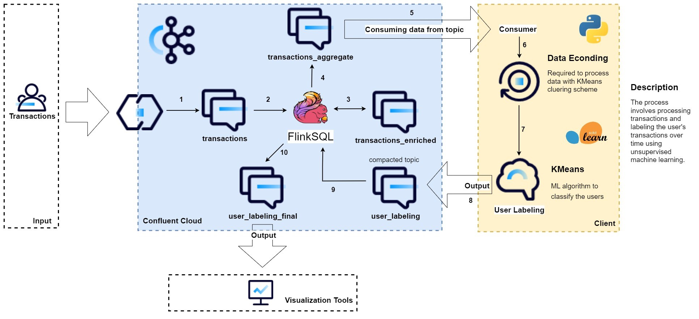
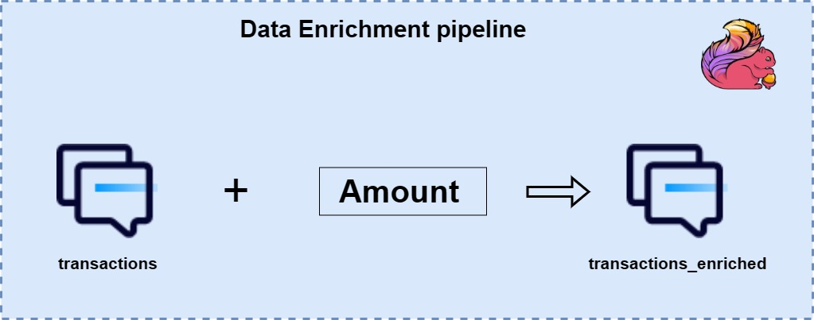
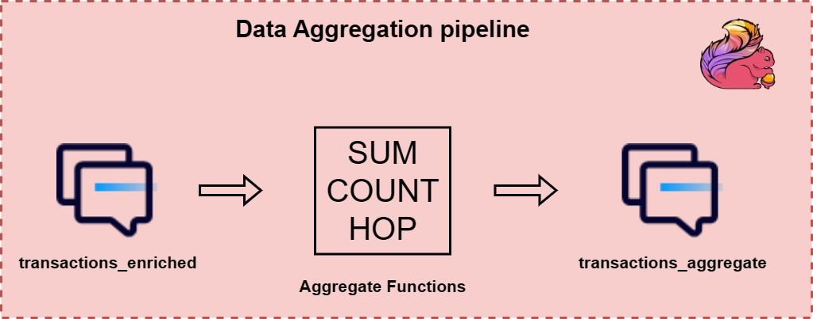
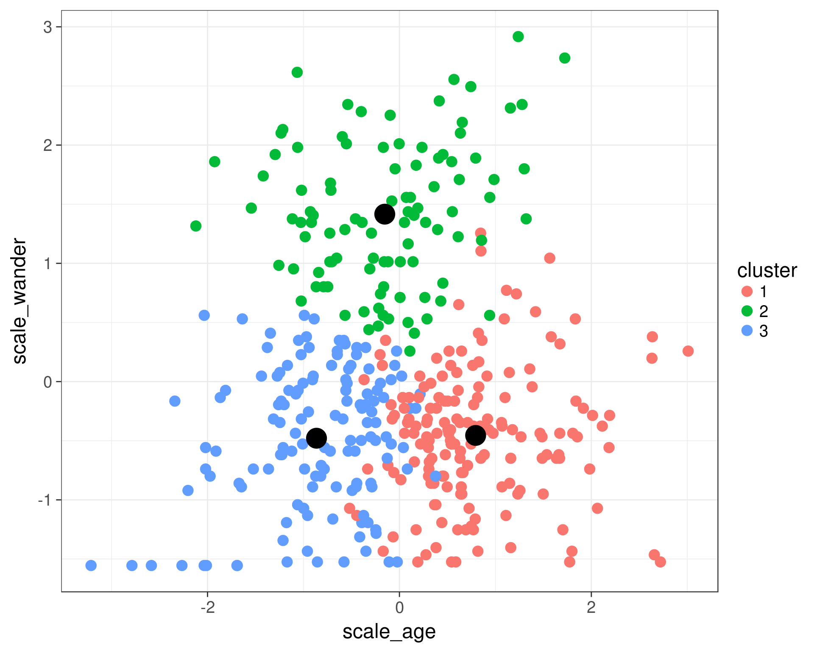
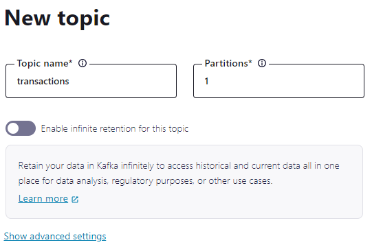
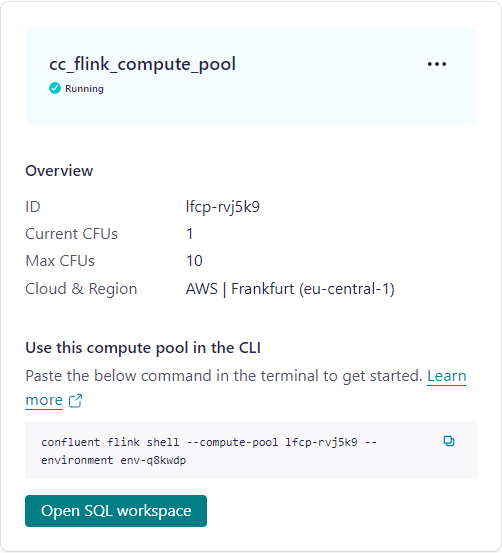
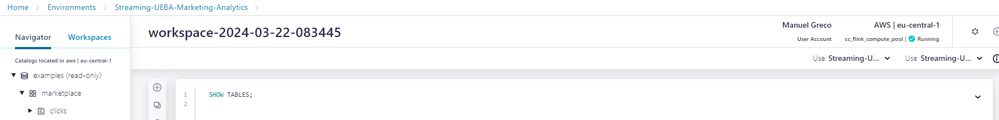
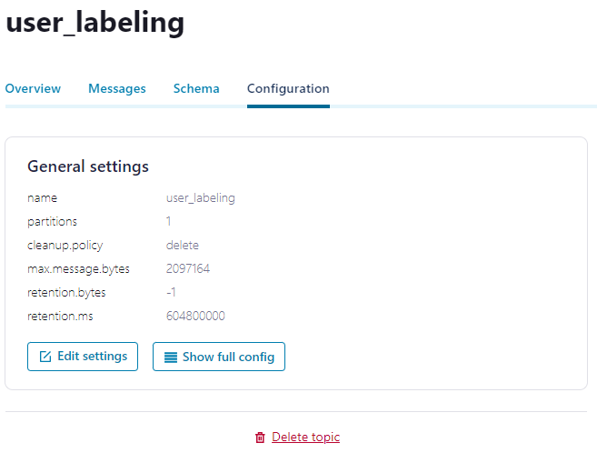
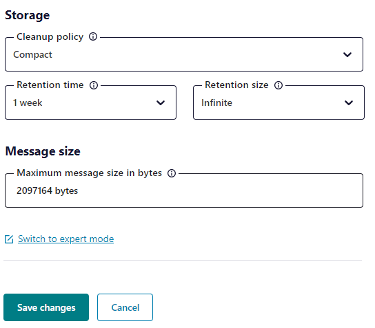
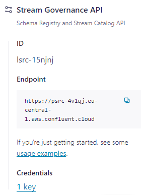

# Streaming UEBA Marketing Analytics

* **Requirements and Objectives**
* **Architectural Solution**
* **Clustering Details**
* **Resources Used**
* **Getting started** 


## Requirements and Objectives

- **Why are we doing this?** **What is the purpose?** **Where do we want to get to?**

  In any business context, starting from input data, particularly transactional data, our primary goal is to extract information related to user behaviour. To achieve this objective, we are interested in adopting a data-driven approach, utilizing advanced unsupervised machine learning techniques such as K-means clustering (which brings numerous advantages, including speed and simplicity).

  As we navigate through our data flow, it is crucial to enrich our dataset with additional attributes that identify the entity of each transaction. This step is fundamental to ensure that the clustering algorithms produce meaningful results and facilitate more precise user segmentation.

  In this context, our main objective is enhancing our real-time reporting and analytics capabilities. We aim to gain a deeper understanding of user behaviour through effective labelling strategies while simplifying our development processes for increased efficiency and agility.


## Architectural Solution

- **Description of Data Source**
  - Source and data model (layout) 


| **Topic**              | **Schema**                                                   |
| ---------------------- | ------------------------------------------------------------ |
| transactions           | (transaction_id: *long*, card_id: *long*, user_id: *string*, purchase_id: *long*, store_id: *int*) |
| transactions_enriched  | (transaction_id: *long*, card_id: *long*, user_id: *string*, purchase_id: *long*, store_id: *int*, amount: *double*) |
| transactions_aggregate | (user_id: *string*, total_amount: *double*, num_transactions: *long*) |
| user_labeling          | (user_id: *string*, total_amount: *double*, num_transactions: *long*, label: *int*) |
| user_labeling_final    | (user_id: *string*, total_amount: *double*, num_transactions: *long*, label: *int*) |


- **Architectural Diagram and description of the solution**

  


  - **Legend:**

    ***Description of the streaming pipeline:***

    1. Input data streaming related to transactions is received within the "transactions" topic.
    2. Leveraging the power of FlinkSQL, the data is enriched by adding transaction entity information and sent in another topic called "transactions_enriched". This operation is necessary to ensure meaningful user labelling, but it could be bypassed if the input already contains such information.
    3. The data is then aggregated, utilizing FlinkSQL aggregation functions such as COUNT, SUM, and grouped by user_id.
    4. The output of the aggregation is sent within another topic called "transactions_aggregate".
    5. Point 5 represents the bridge between Confluent and the client. The content of the "transactions_aggregate" topic is consumed by a Kafka consumer in the Python script to access the data on the client side.
    6. The data is processed and prepared to be fed into the unsupervised machine learning algorithm used. In particular, an encoder is applied to the user_id column (string) to transform it into binary values (as KMeans does not accept strings as input data).
    7. The properly formatted data is fed into the KMeans clustering scheme.
    8. The algorithm produces several clusters, to which it assigns a numerical label, and the output data is then written to a topic on Confluent, named "user_labeling" (compacted topic), using a Kafka producer. This topic is set to compacted to keep only the latest record with the same key (an action necessary for correct and updated user classification).
    9. The most updated data related to each user is selected by FlinkSQL and then compactly printed to another topic.
    10. Using FlinkSQL, the content of the "user_labeling" topic is printed to the "user_labeling_final" topic compactly. Finally, the output data can be visualized using any data visualization tool.
    
    
    
- **Pipeline Details**
  
  - Enrichment and aggregation pipeline
  
    
    - Starting from the topic containing users' transactions, they are enriched through FlinkSQL by adding a double field called "amount" that identifies the transaction entity, and then sent within a new topic, "transactions_enriched".
  
    
    -  Starting from the topic containing transactions of users enriched with the "amount" field, FlinkSQL applies aggregation functions (SUM --> sum of the "amount" for each user, COUNT --> number of transactions for each user, HOP --> retrieval of only the transactions within a specific time window) and the transactions are grouped by user_id. Finally, the output of this operation is sent within a new topic, "transactions_aggregate".

## Clustering Details

- **Application of k-means and further details**

  - ***Kmeans algorithm***

    K-means clustering is an unsupervised machine learning algorithm used to group a set of data into homogeneous clusters. This algorithm is widely used in various fields.

    The goal of K-means clustering is to divide a dataset into K clusters, where K is a user-specified predefined number. Each cluster is represented by a central point called a "centroid," which is the average point of all the points in the cluster.

    At the end of the process, the data is divided into K clusters, and each point in the dataset is associated with one of the clusters. The algorithm aims to minimize the variation within each cluster and maximize the difference between the centroids of different clusters.

    K-means clustering is an efficient and scalable algorithm, but it requires that the number of clusters K be specified in advance and can be sensitive to the initial choice of centroids. However, this is not a problem for us as we are aware of the user labels we want to have as output.

  - ***Kmeans Use case***

    In our case, we first need to transform the "user_id" column (initially string) into numerical data as K-means only processes data of this type. Then, once we have found the optimal number of clusters, we instantiate a K-means clustering scheme with the following parameters: 

    ```python
    ##random_state to ensure the reproducibility of the experiment
    km = KMeans(n_clusters=k_optimal, init='k-means++', n_init='auto', random_state=42).
    ```
    
     We fit the model with the input data and produce user labels using the model.
    
    ```python
    ##compute cluster centres and predict cluster index for each sample
    y_km = km.fit_predict(X)
    ```
    
    ***Example:***
    
    


## Resources Used

- **Kafka Cluster**
  - ***Type***: Basic
  - ***Provider***: AWS
  - ***Region***:  eu-central-1
  - ***Availability***: Single zone

- **Flink Pool**
  - ***Cloud provider & region:*** AWS | eu-central-1
  - ***Max CFUs***: 10

- **Python version:** Python 3.10.12


## Getting started 

### 1. Add Environment

Create a basic environment called: **Streaming-UEBA-Marketing-Analytics**.

The correct **configuration** for our scope is:

| Cloud details      |              |
| ------------------ | ------------ |
| ***Provider***     | AWS          |
| ***Region***       | eu-central-1 |
| ***Availability*** | Single zone  |
| ***Type***         | Basic        |

### 2. Create Topic

Add **transactions** topic with **single partition** and **default settings:**



### 3. **Datagen Connectors**

**Your Kafka cluster should have one Datagen Source Connector running**. 

**To add Datagen Source Connector:**

- In the left sidebar of cluster **Streaming-UEBA-Marketing-Analytics**, select "***Connectors***"
- Press on "**Add Connector**" button
- Select  **Sample Data (Datagen Source)**
- Choose the topics you want to send data to (for our scope **we choose transactions)**
- **Select Global access** to allow your connector to access everything you have access to and **Generate API key & download**
- **Select output record value format --> AVRO**
- **Select a schema **--> Show more options and **select Transactions**
- Set the connector name to **DSoC_transactions** and for the next steps, press "Continue" to maintain the default settings.


Check if the topic and template configurations match the table below.

| **Connector Name (can be anything)** |  **Topic**   | **Format** | **Template** |
| ------------------------------------ | :----------: | ---------: | -----------: |
| DSoC_transactions                    | transactions |       AVRO | TRANSACTIONS |

### 4. **Create Pool**

#### **Create Flink Compute Pool**
**Create** **a Flink Compute Pool in environment `Streaming-UEBA-Marketing-Analytics`** with specific present in the table below. 

| Cloud Provider |  **Region**  | **Max CFUs** |
| -------------- | :----------: | -----------: |
| AWS            | eu-central-1 |           10 |

Now go back to environment `Streaming-UEBA-Marketing-Analytics` and choose the `Flink` Tab. From there we create a new compute pool:

* **choose a** **cloud region**, click `continue` and 

* **enter Pool Name:** `cc_flink_compute_pool` with 10 Confluent Flink Units (CFU) and 

* **click `Continue` button and then `Finish`.**

* The pool will be provisioned and ready to use in a couple of moments.
  AWS Pools take 1-2 minutes. Azure Pools can take 5-7 minutes.

  

**NB. We suggest selecting `AWS` as Cloud provider and `eu-central-1` as region**

### 5. Connecting to Flink 
You can use your web browser or console to enter Flink SQL statements. In this project, the workspace integrated in Confluent was used.
  * **Web UI** - click on the button `Open SQL workspace` on your Flink Compute Pool
    You now have to set which catalog and database you want to use:
    
    - Set the environment name **`Streaming-UEBA-Marketing-Analytics`** as catalog,
    - and the cluster name **`Streaming-UEBA-Marketing-Analytics-cluster`** as database
    
    via the dropdown boxes, see the graphic below
    
    


  * **Console** - copy/paste the command from your Flink Compute Pool to the command line.    
    Of course, you could also use the Flink SQL Shell. For this, you need to have the Confluent Cloud Console tool installed and be logged in with correct access rights.
      Copy the command out of the Compute Pool Window and execute it in your terminal (we prefer iterm2). 
  ```bash
  confluent flink shell --compute-pool <pool id> --environment <env-id>
  ```

**NOTE**: You can also access your Flink Compute Pool from the Data Portal. Just click on `Data Portal` in the main menu on the left side. Then select your Environment. You should see your topics. When you click on any of the topic tiles you can query the topic's data using Flink. 

### 6. Flink Tables
**Let's start with exploring our Flink tables.**
**Kafka topics and schemas are always in sync with our Flink cluster**. Any topic created in Kafka is visible directly as a table in Flink, and any table created in Flink is visible as a topic in Kafka. Effectively, Flink provides a SQL interface on top of Confluent Cloud.

The following mappings exist:
| Kafka          |  Flink   |
| -------------- | :------: |
| Environment    | Catalog  |
| Cluster        | Database |
| Topic + Schema |  Table   |

Now, we can try typing **`SHOW TABLES`** command to verify that the transactions table exists.

### 7. Enriched Data with FlinkSQL

Let's create a new table to send enriched transactions:

```sql
CREATE TABLE transactions_enriched (
  transaction_id BIGINT,
  card_id  BIGINT,
  user_id STRING,
  purchase_id BIGINT,
  store_id INT,
  amount DOUBLE 
)WITH (
    'changelog.mode' = 'retract'
);
```

Now, insert data into the table just created:

```sql
INSERT INTO transactions_enriched(
transaction_id,
card_id,
user_id,
purchase_id,
store_id,
amount)
SELECT
    t.transaction_id,
    t.card_id,
    t.user_id,
    t.purchase_id,
    t.store_id,
    FLOOR(RAND() * 100) AS amount
FROM transactions t
```

**NOTE**: This operation is necessary to ensure meaningful user labelling (leveraging the power of ML algorithm), but it could be bypassed if the input already contains such information.

### 8. Aggregate Data with FlinkSQL

 **`transactions_aggregate`** serves as the input table for the machine learning algorithm used.

First, create a new table to send aggregate transactions:

```sql
CREATE TABLE transactions_aggregate (
  user_id STRING,
  total_amount DOUBLE,
  num_transactions BIGINT
)WITH (
    'changelog.mode' = 'retract'
);
```

Then, insert data into the table just created using the aggregation functions of FlinkSQL. In particular **SUM, COUNT, HOP** and we group by ***user_id*** so that we obtain one row for each user:

```sql
INSERT INTO transactions_aggregate(
user_id,
total_amount,
num_transactions)
SELECT user_id, SUM(amount) as total_amount, COUNT(purchase_id) as num_transactions
FROM TABLE(HOP(TABLE transactions_enriched, DESCRIPTOR($rowtime), INTERVAL '5' MINUTES, INTERVAL '10' MINUTES))
GROUP BY user_id;
```

### 9. Create `user_labeling` Topic

Before running the Python file, it is necessary to create an additional output topic called `user_labeling` . 
This can be done

- either from FlinkSQL,
- or from the Confluent environment by repeating step number 2 (making sure to change the topic name to `user_labeling`).

Once the topic is created, we find ourselves in the situation shown in the image below:



Press the button "***Edit settings***" and select **`compact`** as the Cleanup policy. This operation is necessary to maintain within the topic `user_labeling` only the most updated information regarding users:



For visualization purposes, run the following two statements in FlinkSQL:

```sql
CREATE TABLE user_labeling_final (
  user_id STRING,
  total_amount DOUBLE,
  num_transactions BIGINT,
  label INT
)WITH (
    'changelog.mode' = 'retract'
);

INSERT INTO user_labeling_final(
user_id,
total_amount,
num_transactions,
label)
SELECT user_id, total_amount, num_transactions, label
FROM user_labeling
```


### 10. Python Client

Once the FlinkSQL queries have been executed, we can start the Python client, which will apply the KMeans clustering scheme to the data from **"transactions_aggregate**", producing labeled users as output. 

**As a first step**, it is necessary to clone the code from the repository locally using the git clone command:

```bash
git clone https://github.com/Data-Reply/streamingUEBA
```

The client requires a configuration file **`configuration.ini`** as an argument, where all the necessary credentials and configurations to access the previously instantiated resources will be inserted.

The Python command to run the client is:

```bash
python user_classifier.py ./configurations/configuration.ini
```

The file configuration.ini  must contain the following configurations to enable the correct execution of the client:

```ini
[schema_registry]
url = https://<schema-registry-URL>
basic.auth.user.info = <token>

[consumer]
bootstrap.servers = <hostname>:<hostname-port>
security.protocol = SASL_SSL
sasl.mechanisms = PLAIN
sasl.username = <user>
sasl.password = <password>
group.id = args.group
auto.offset.reset = earliest

[producer]
bootstrap.servers =  <hostname>:<hostname-port>
security.protocol = SASL_SSL
sasl.mechanisms = PLAIN
sasl.username = <user>
sasl.password = <password>
```

The ***URL of the schema registry*** can be found in "**Environment**", then the right sidebar under **Stream governance API**. It is also necessary to create a specific key, which should be inserted in "**basic.auth.user.info**".



For the consumer and producer credentials, it is necessary to create an API KEY from **Cluster Overview --> API keys** (As you can notice, the same credentials are used for these two components).

### 11. Data Visualization 

Once the client is executed, it will have produced the output of the machine learning algorithm inside a topic on Confluent named `user_labeling`, utilizing a Kafka producer.

The format of output data is:

| user_id | total_amount | num_transactions | label |
| ------- | ------------ | ---------------- | ----- |
| User_9  | 102.0        | 4                | 0     |
| User_   | 2015.4       | 34               | 2     |
| User_6  | 608.8        | 13               | 1     |

To obtain the previous output, simply return to the SQL workspace and type:

```sql
SELECT * FROM user_labeling_final
```

Finally, it is possible to read the data from the topic in question and visualize it in any data visualization tool using a Confluent connector.


### Summary

Before we can run the hands-on workshop, a working infrastructure in Confluent Cloud must exist:

- an environment with Schema Registry enabled
- a Kafka Cluster
- 5 topics
- events generated by our Sample Data Datagen Source connector

### Kafka Topics

Check if the following topics exist in your Kafka cluster:

 * ***transactions*** (for real-time streaming of transactions),
 * ***transactions_enriched***(for transactions enriched with amount that represent the transaction entity information),
 * ***transactions_aggregate***(for aggregate transactions),
 * ***user_labeling*** (for the labelled users),
 * ***user_labeling_final*** (for the labelled users compacted).

### Schemas in Schema Registry

Check if the following Avro schemas exist in your Schema Registry:

 * transactions-value,
 * transactions_enriched-value,
 * transactions_aggregate-value,
 * user_labeling-value,
 * user_labeling-final_value.


